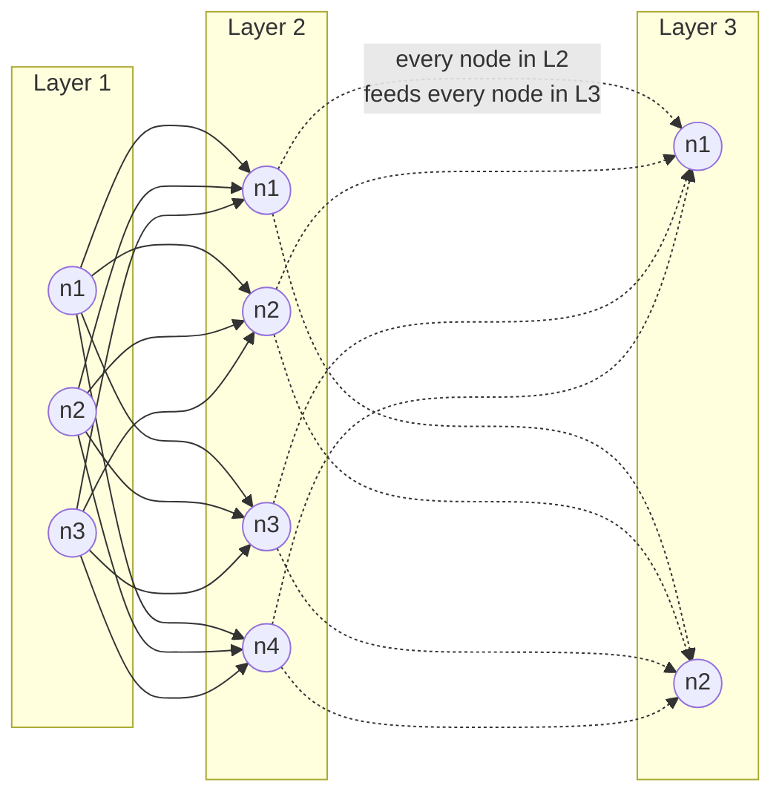
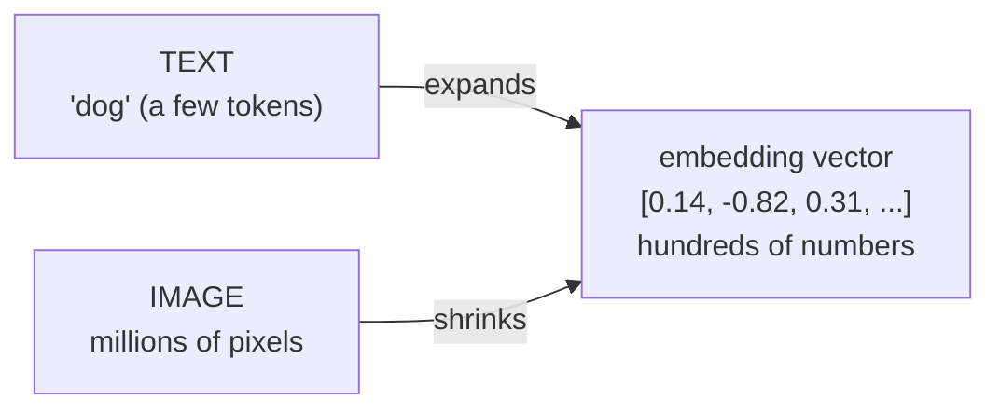
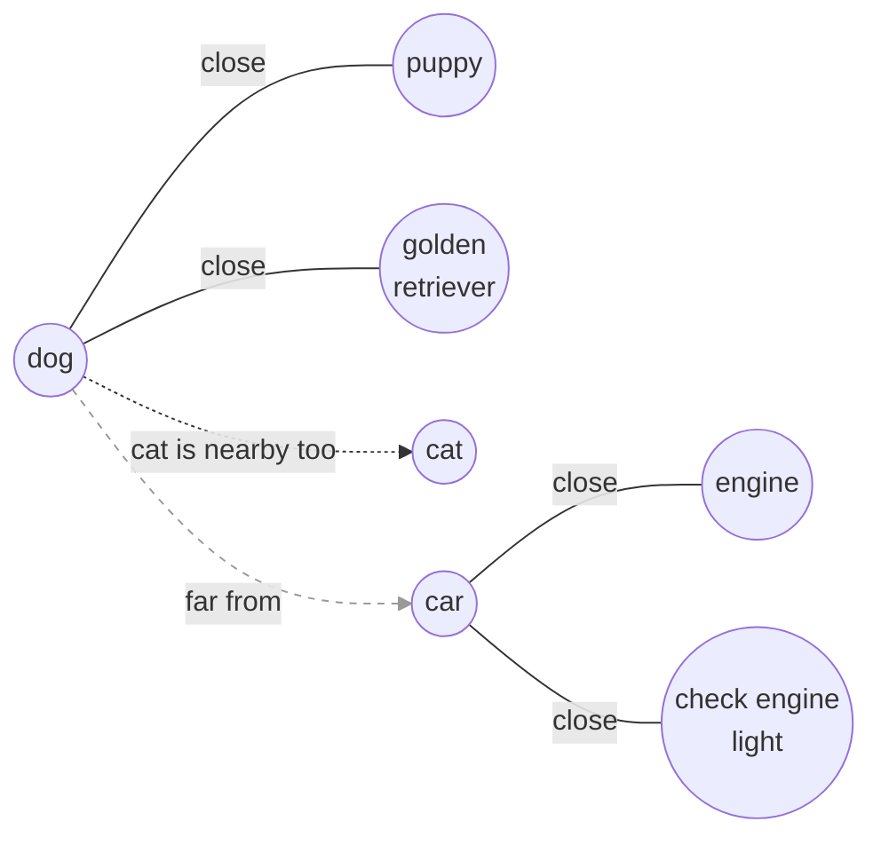
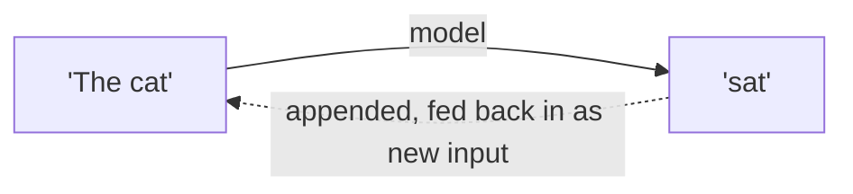
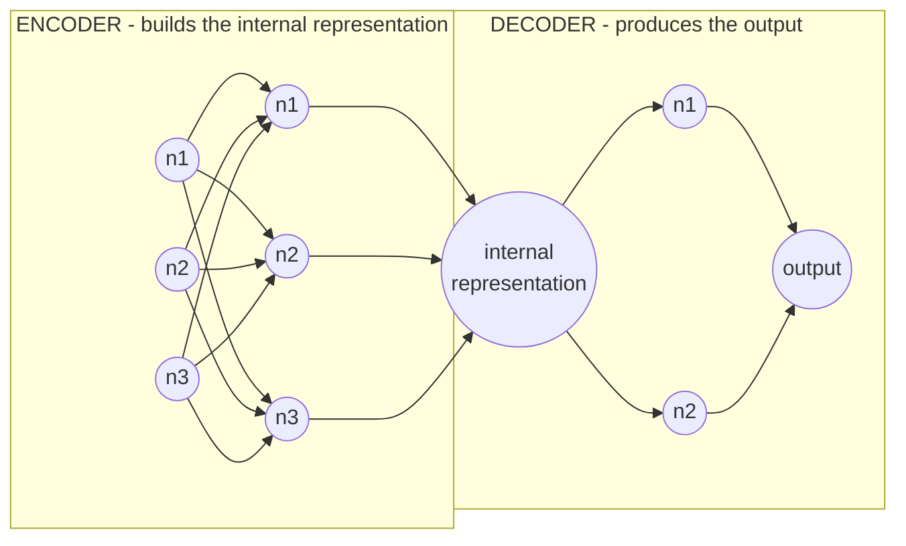

# Inference Engineering - Chapter 2: Models

**Source:** *Inference Engineering* by Philip Kiely
**Related:** `100-days-of-inference` repo, Day 02 (`day02/` - tokenization, model internals) covers overlapping ground. Reading the book directly instead, building my own notes rather than following the repo's notebooks.

## Layers, nodes, and connections

> "A group of nodes forms a layer. Nodes within a layer are independent of each other - they do their own calculations. The connection between nodes, or the 'network' in a neural network, is between layers, where the nodes in a layer receive the output of the previous layer."



No line ever connects two nodes inside the same layer box. Each one computes independently, in parallel - no idea what its neighbors are doing. Every connection crosses between layers instead: a node sends its output to *every* node in the next layer, not just one.

A layer, really, is just a group of nodes - not a stand-in for a single node the way I kept half-assuming. So when the book says "the connection is between layers," it's describing the overall pattern (wires only ever cross layer boundaries), not claiming connections skip individual nodes. Zoom in and it's still node-to-node wiring; zoom out and the pattern reads as layer-to-layer.

Flow, start to finish: input arrives, Layer 1's nodes each compute on their own, all of those outputs get handed to every node in Layer 2, Layer 2 computes, and so on until the output layer. Every node is doing the same basic calculation: take everything it receives, multiply each piece by its own learned weight, add a bias term, and combine it all into one output number (`weight x input + bias`). That single number is what gets passed forward.

## Dimensionality: text expands, images shrink

> "Internal representations for text input increase the dimensionality, encoding text chunks into vectors of hundreds or thousands of numbers to capture semantic meaning. But internal representations for image models reduce the dimensionality from millions of pixels down to a manageable size."



Text starts small - a handful of tokens - and expands outward into a vector of hundreds or thousands of numbers, because a few raw tokens can't hold enough nuance on their own. Images run the opposite direction: millions of raw pixels, most of it redundant, get compressed down into that same kind of fixed-size vector. Different starting points, same destination - one fixed-size embedding that's supposed to capture "meaning."

What "semantic" actually means - a map where distance stands for meaning, not spelling:



That's the part I kept getting hung up on with "semantic search." In this embedding space, points land near each other based on what they mean, not how they're spelled - "dog," "puppy," and "golden retriever" cluster together; "car" and "engine" sit way off to the side, even though "dog" and "car" don't share a single letter. So a semantic search for "puppy" can surface a document that only ever said "golden retriever" - the model finds the nearest point in meaning-space, not the nearest matching string.

## Model types: image vs. text, autoregressive generation

Image and text models end up architected differently for the same reason as the dimensionality split above - one compresses, one expands - but underneath, both are still built from the same neuron/layer structure.

Worth locking in the right word here: **autoregressive**, not "regressive." Regression means predicting a continuous number, a different thing entirely. Autoregressive generation means producing output one token at a time - predict a token, append it to the input, feed the whole thing back in, predict the next one, repeat until done:



## Neurons, layers, hidden layers, encoder/decoder



A neuron is the smallest unit - same thing as "node" above, just the book's preferred word. A group of neurons makes a layer, and every layer except the first (input) and last (output) counts as a hidden layer.

The encoder/decoder split follows naturally from that: the input-side layers are the encoder, squeezing the raw input down into one internal representation. The output-side layers are the decoder, taking that representation and expanding it back out into the final answer. I had this backwards the first time I tried to explain it out loud - easy mix-up, so worth writing down plainly: encoder builds the representation, decoder consumes it.

## §2.1.1 Linear Layers and Matmul

**Vector vs. matrix, quickly:** a vector is a single list of numbers (one row or one column). A matrix is a grid of numbers, rows stacked on columns - really just several vectors lined up together.
```
vector:        matrix:
[2]            [ 1   2 ]
[1]            [ 0   1 ]
               [ 3  -1 ]
```

A linear layer is the simplest form of matrix multiplication: an input vector goes in, gets multiplied by a weight matrix, a bias vector gets added, and an output vector comes out. First read that felt like a new concept on top of everything above, but it isn't - it's the same "each neuron computes `weight x input + bias`" idea, just written for a whole layer at once instead of one neuron at a time.

Take the 3-neuron layer from earlier and give it a 2-number input, `x = [2, 1]`:

```
weight matrix W (3 neurons x 2 inputs)      input x       bias b       output
[ 1   2 ]                                   [2]            [1]          [5]   <- neuron 1
[ 0   1 ]            x                      [1]      +     [0]     =    [1]   <- neuron 2
[ 3  -1 ]                                                  [2]          [7]   <- neuron 3
```

Each row of the matrix belongs entirely to one neuron. Row 1 (`1, 2`) is neuron 1's weights, nobody else's - multiply it against the input, add neuron 1's own bias (1), and that's neuron 1's output: `(1x2) + (2x1) + 1 = 5`. Same for row 2: `(0x2) + (1x1) + 0 = 1`. Row 3: `(3x2) + (-1x1) + 2 = 7`.

So `Wx + b` isn't a separate operation bolted onto the neuron picture - it's the exact same per-neuron calculation, packed row by row into one matrix so all three neurons get computed in a single step instead of a loop.

## Activation functions - why a network needs them at all

Stack linear layers with nothing between them and the math collapses on itself: `W2(W1x + b1) + b2` simplifies algebraically into one single `W'x + b'`. A 50-layer network with no activations is mathematically no more powerful than a 1-layer network, no matter how deep it looks on paper.

```
Stacked linear layers, no activation        Stacked layers WITH ReLU between them
(always collapses to one straight line)     (genuinely bends - new shapes possible)

  y                                           y
  |                    .                      |              .
  |                  .                        |         . .
  |                .                          |       .
  |              .                            |   . .
  |____________.______ x                      |_.__________ x
```

That collapse is exactly what an activation function exists to prevent - it sits between every pair of linear layers specifically to break the chain, so depth actually buys something.

**ReLU (Rectified Linear Unit)** is the simplest, most common one:

```
ReLU(x) = max(0, x)

  y
  |                /
  |              /
  |            /
  |__________/________ x
  |        0
   (x < 0 -> output 0, flat)   (x > 0 -> output = x, unchanged)
```

Every neuron produces a raw number first (`weight x input + bias`) - that raw number is the pre-activation. Run it through ReLU and the result is the neuron's **activation**: negative input becomes 0, positive input passes through unchanged. That's the whole rule. "Activation function" is just the name for whatever bends that raw number before it moves on to the next layer.

## Open Questions
- How exactly does an image model's pixel-to-embedding compression decide what's "redundant" vs "meaningful"? Revisit once I'm hands-on with a vision encoder.

## Next session
Continue from §2.1.1, past the linear-layer/matmul equivalence above.
