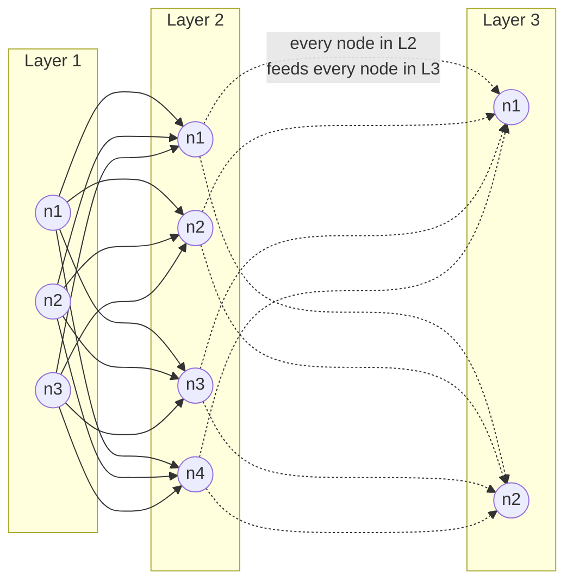
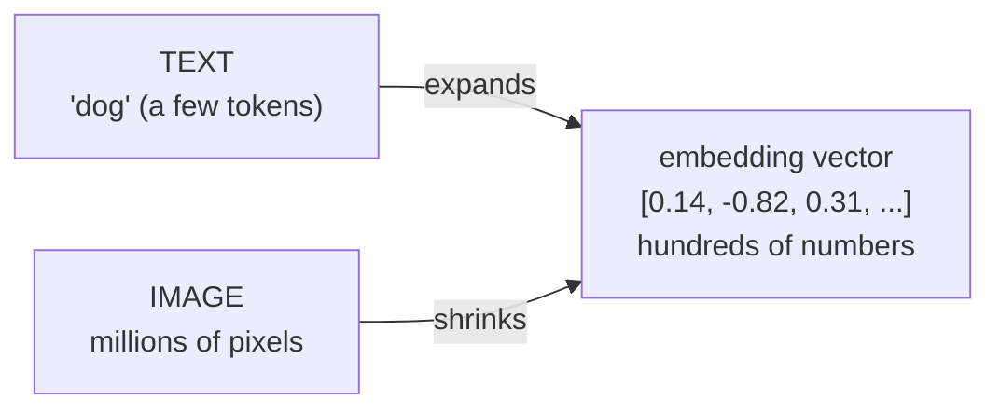
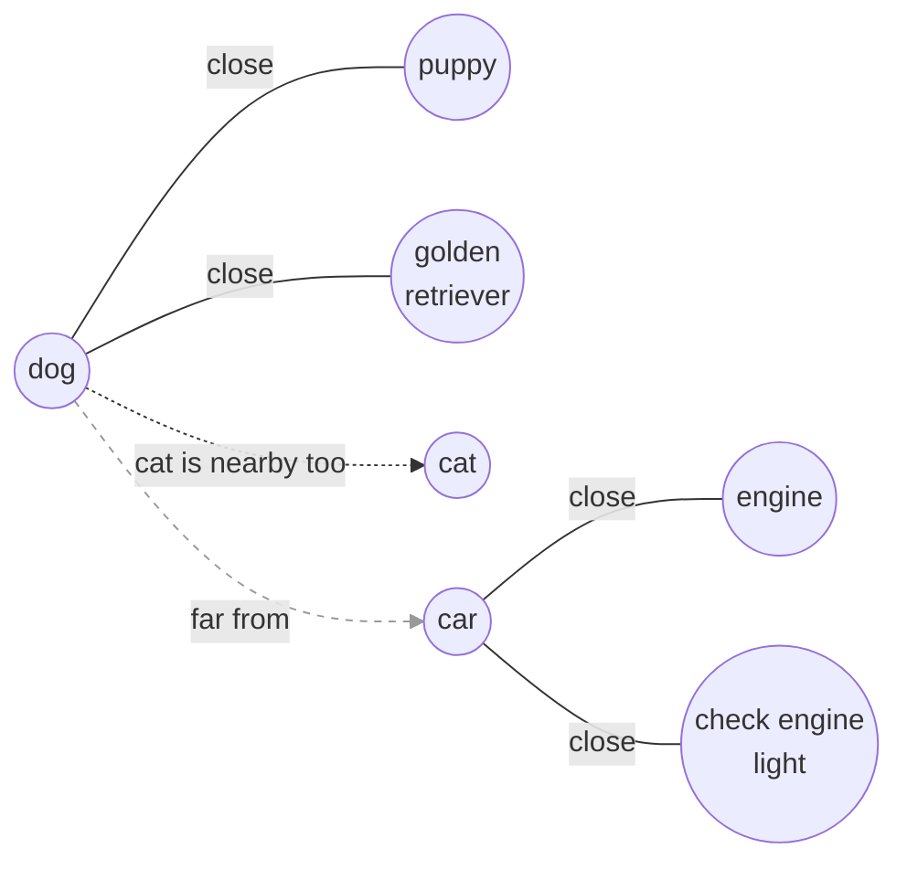
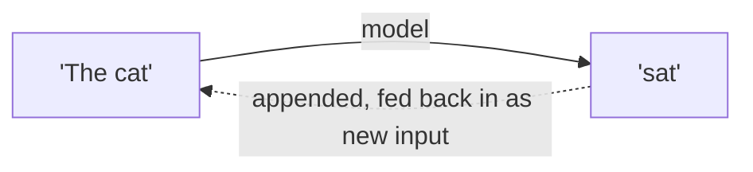
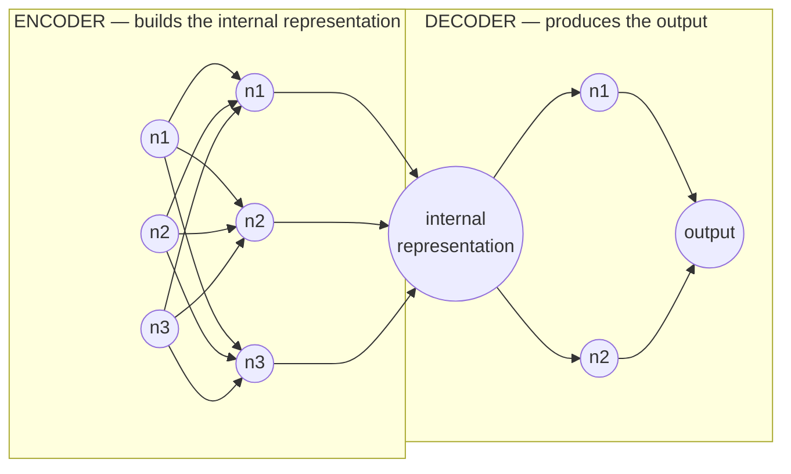

# Inference Engineering — Chapter 2: Models

**Source:** *Inference Engineering* by Philip Kiely
**Related:** `100-days-of-inference` repo, Day 02 (`day02/` — tokenization, model internals) covers overlapping ground; reading the book directly per own choice, building own notes rather than following the repo's notebooks.

## Layers, nodes, and connections

> "A group of nodes forms a layer. Nodes within a layer are independent of each other — they do their own calculations. The connection between nodes, or the 'network' in a neural network, is between layers, where the nodes in a layer receive the output of the previous layer."

No line ever connects two nodes inside the same layer box — each computes independently, in parallel. All connections cross **between** layers: every node in one layer feeds every node in the next.

**Key points:**
- A **layer** is a *group* of nodes, not a stand-in for a single node — nodes compose layers.
- Nodes **within** a layer never connect to each other — each computes independently, in parallel.
- Connections only cross **between** layers: every node in one layer sends its output to every node in the next layer.
- "Connection is between layers" describes the *pattern* (cross-layer only) — the actual wires are still node-to-node, just zoomed out.
- Flow: input → Layer 1 nodes compute independently → **all** of Layer 1's outputs handed to **every** Layer 2 node → Layer 2 computes → repeats to output. Each node combines *all* of the previous layer's outputs using its own weights (`weight × input + bias`, from the Module 04 activations work) to produce one output number.

## Dimensionality: text expands, images shrink

> "Internal representations for text input increase the dimensionality, encoding text chunks into vectors of hundreds or thousands of numbers to capture semantic meaning. But internal representations for image models reduce the dimensionality from millions of pixels down to a manageable size."

**Key points:**
- **Text:** starts small (a handful of tokens) → **expands** to a vector of hundreds/thousands of numbers (an embedding) to capture nuance/meaning that a few raw tokens can't hold.
- **Images:** start huge (millions of raw pixels, mostly redundant/correlated) → **shrink** down to the same kind of fixed-size embedding vector, discarding redundancy while keeping the meaningful content.
- Both processes converge on the *same kind of object*: a fixed-size embedding vector — text gets there by expanding, images get there by compressing.

**What "semantic" means — a map where distance = meaning, not spelling:**

- **"Semantic" = about meaning, not spelling/pixels.** In the embedding space, points get placed by what they *mean* — "dog," "puppy," "golden retriever" cluster close together; "car," "engine" sit far away, even though "dog" and "car" share zero letters.
- **Semantic search** = finding the nearest points in that space to a query's embedding. Searching "puppy" can surface a document that only ever said "golden retriever" and never used the word "puppy" — because they're close together in meaning-space, not in spelling.

## Model types: image vs. text, autoregressive generation

- **Image models** and **text models** are architected differently for the same reason as the dimensionality section above — image models compress (millions of pixels → small representation), text models expand (few tokens → large representation) — but both are still built from the same neuron/layer structure underneath.
- **Autoregressive** (not "regressive" — different term, regression means predicting a continuous number) generative models produce output **one token at a time**: predict a token, append it to the input, feed the whole thing back in, predict the next token. Repeats until done.

## Neurons, layers, hidden layers, encoder/decoder

**Key points:**
- **Neuron** = the smallest unit (same thing as "node" from the Layers section above). A group of neurons forms a **layer**.
- Every layer except the **first** (input layer) and **last** (output layer) is a **hidden layer**.
- **Encoder** = the input-side layers, which process the raw input down into one **internal representation**.
- **Decoder** = the output-side layers, which take that internal representation and expand it back out into the final output.
- Common mix-up worth flagging for next time: it's easy to say these backwards — encoder *builds* the representation, decoder *consumes* it to produce output, not the other way round.

## Open Questions
- How exactly does an image model's pixel→embedding compression decide what's "redundant" vs "meaningful"? (Revisit when hands-on with a vision encoder.)

## Next session
Resume from **§2.1.1 Linear Layers and Matmul**.
