# Inference Engineering - Chapter 2: Models

**Source:** *Inference Engineering* by Philip Kiely
**Related:** `100-days-of-inference` repo, Day 02 (`day02/` - tokenization, model internals) covers overlapping ground. Reading the book directly instead, building my own notes rather than following the repo's notebooks.

## Layers, nodes, and connections

> "A group of nodes forms a layer. Nodes within a layer are independent of each other - they do their own calculations. The connection between nodes, or the 'network' in a neural network, is between layers, where the nodes in a layer receive the output of the previous layer."

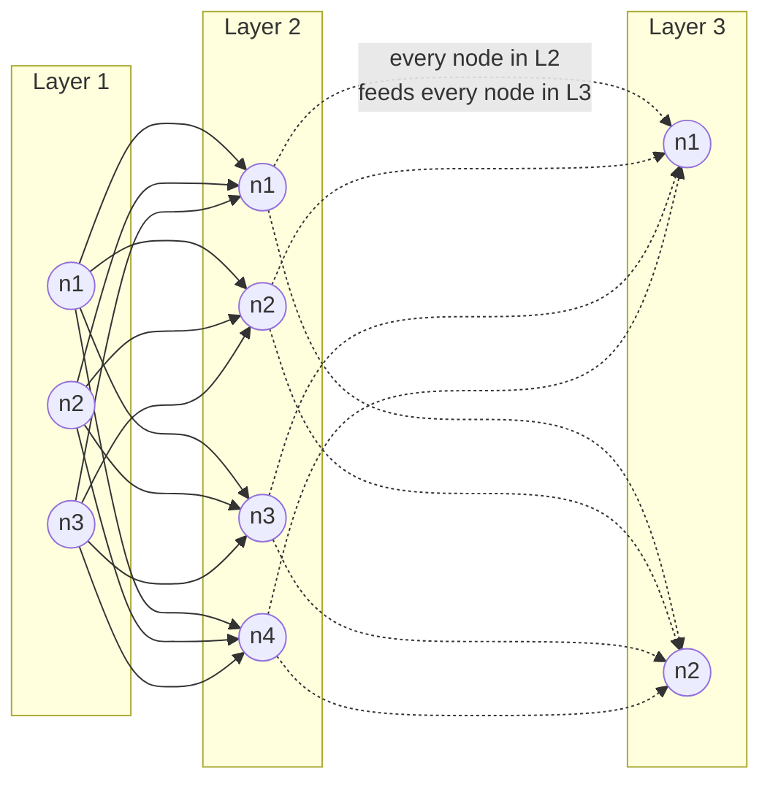

No line ever connects two nodes inside the same layer box. Each one computes independently, in parallel - no idea what its neighbors are doing. Every connection crosses between layers instead: a node sends its output to *every* node in the next layer, not just one.

A layer, really, is just a group of nodes - not a stand-in for a single node the way I kept half-assuming. So when the book says "the connection is between layers," it's describing the overall pattern (wires only ever cross layer boundaries), not claiming connections skip individual nodes. Zoom in and it's still node-to-node wiring; zoom out and the pattern reads as layer-to-layer.

Flow, start to finish: input arrives, Layer 1's nodes each compute on their own, all of those outputs get handed to every node in Layer 2, Layer 2 computes, and so on until the output layer. Every node is doing the same basic calculation: take everything it receives, multiply each piece by its own learned weight, add a bias term, and combine it all into one output number (`weight x input + bias`). That single number is what gets passed forward.

## Dimensionality: text expands, images shrink

> "Internal representations for text input increase the dimensionality, encoding text chunks into vectors of hundreds or thousands of numbers to capture semantic meaning. But internal representations for image models reduce the dimensionality from millions of pixels down to a manageable size."

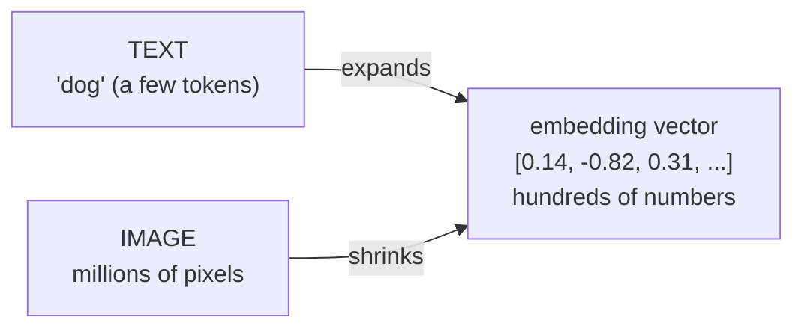

Text starts small - a handful of tokens - and expands outward into a vector of hundreds or thousands of numbers, because a few raw tokens can't hold enough nuance on their own. Images run the opposite direction: millions of raw pixels, most of it redundant, get compressed down into that same kind of fixed-size vector. Different starting points, same destination - one fixed-size embedding that's supposed to capture "meaning."

What "semantic" actually means - a map where distance stands for meaning, not spelling:

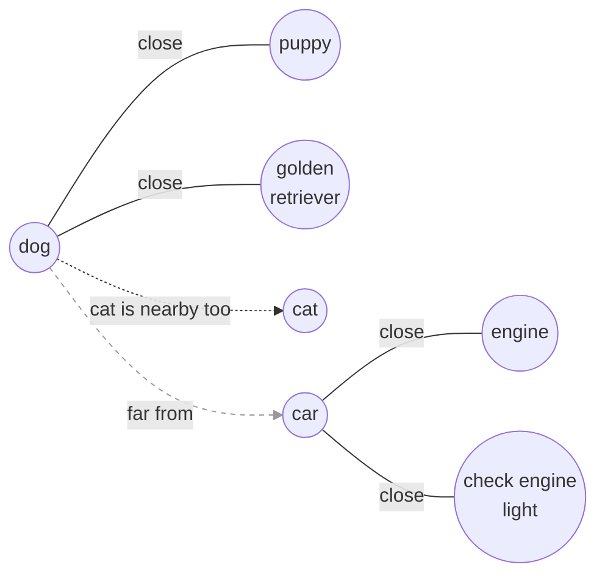

That's the part I kept getting hung up on with "semantic search." In this embedding space, points land near each other based on what they mean, not how they're spelled - "dog," "puppy," and "golden retriever" cluster together; "car" and "engine" sit way off to the side, even though "dog" and "car" don't share a single letter. So a semantic search for "puppy" can surface a document that only ever said "golden retriever" - the model finds the nearest point in meaning-space, not the nearest matching string.

## Model types: image vs. text, autoregressive generation

Image and text models end up architected differently for the same reason as the dimensionality split above - one compresses, one expands - but underneath, both are still built from the same neuron/layer structure.

Worth locking in the right word here: **autoregressive**, not "regressive." Regression means predicting a continuous number, a different thing entirely. Autoregressive generation means producing output one token at a time - predict a token, append it to the input, feed the whole thing back in, predict the next one, repeat until done:

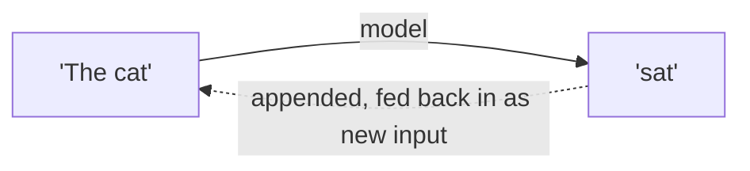

## Neurons, layers, hidden layers, encoder/decoder

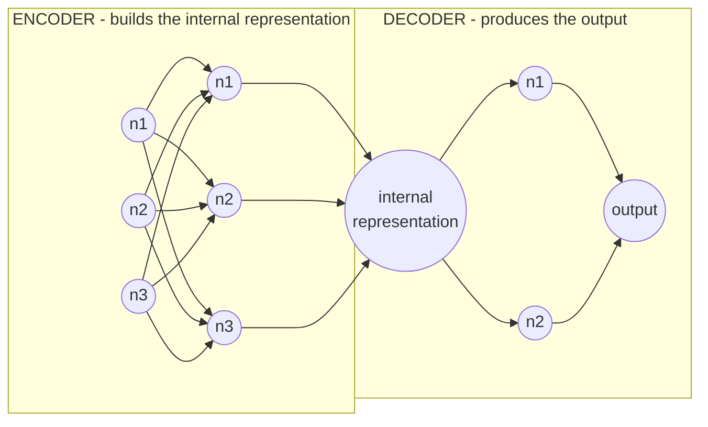

A neuron is the smallest unit - same thing as "node" above, just the book's preferred word. A group of neurons makes a layer, and every layer except the first (input) and last (output) counts as a hidden layer.

The encoder/decoder split follows naturally from that: the input-side layers are the encoder, squeezing the raw input down into one internal representation. The output-side layers are the decoder, taking that representation and expanding it back out into the final answer. I had this backwards the first time I tried to explain it out loud - easy mix-up, so worth writing down plainly: encoder builds the representation, decoder consumes it.

## §2.1.1 Linear Layers and Matmul

**Vector vs. matrix, quickly:** a vector is a single list of numbers (one row or one column). A matrix is a grid of numbers, rows stacked on columns - really just several vectors lined up together.
```
vector:        matrix:
[2]            [ 1   2 ]
[1]            [ 0   1 ]
               [ 3  -1 ]
```

A linear layer is the simplest form of matrix multiplication: an input vector goes in, gets multiplied by a weight matrix, a bias vector gets added, and an output vector comes out. First read that felt like a new concept on top of everything above, but it isn't - it's the same "each neuron computes `weight x input + bias`" idea, just written for a whole layer at once instead of one neuron at a time.

Take the 3-neuron layer from earlier and give it a 2-number input, `x = [2, 1]`:

```
weight matrix W (3 neurons x 2 inputs)      input x       bias b       output
[ 1   2 ]                                   [2]            [1]          [5]   <- neuron 1
[ 0   1 ]            x                      [1]      +     [0]     =    [1]   <- neuron 2
[ 3  -1 ]                                                  [2]          [7]   <- neuron 3
```

Each row of the matrix belongs entirely to one neuron. Row 1 (`1, 2`) is neuron 1's weights, nobody else's - multiply it against the input, add neuron 1's own bias (1), and that's neuron 1's output: `(1x2) + (2x1) + 1 = 5`. Same for row 2: `(0x2) + (1x1) + 0 = 1`. Row 3: `(3x2) + (-1x1) + 2 = 7`.

So `Wx + b` isn't a separate operation bolted onto the neuron picture - it's the exact same per-neuron calculation, packed row by row into one matrix so all three neurons get computed in a single step instead of a loop.

## Activation functions - why a network needs them at all

Stack linear layers with nothing between them and the math collapses on itself: `W2(W1x + b1) + b2` simplifies algebraically into one single `W'x + b'`. A 50-layer network with no activations is mathematically no more powerful than a 1-layer network, no matter how deep it looks on paper.

```
Stacked linear layers, no activation        Stacked layers WITH ReLU between them
(always collapses to one straight line)     (genuinely bends - new shapes possible)

  y                                           y
  |                    .                      |              .
  |                  .                        |         . .
  |                .                          |       .
  |              .                            |   . .
  |____________.______ x                      |_.__________ x
```

That collapse is exactly what an activation function exists to prevent - it sits between every pair of linear layers specifically to break the chain, so depth actually buys something.

**ReLU (Rectified Linear Unit)** is the simplest, most common one:

```
ReLU(x) = max(0, x)

  y
  |                /
  |              /
  |            /
  |__________/________ x
  |        0
   (x < 0 -> output 0, flat)   (x > 0 -> output = x, unchanged)
```

Every neuron produces a raw number first (`weight x input + bias`) - that raw number is the pre-activation. Run it through ReLU and the result is the neuron's **activation**: negative input becomes 0, positive input passes through unchanged. That's the whole rule. "Activation function" is just the name for whatever bends that raw number before it moves on to the next layer.

## Open Questions
- Why is prefill compute-bound while decode is memory-bound? Next thing to work out.
- How exactly does an image model's pixel-to-embedding compression decide what's "redundant" vs "meaningful"? Revisit once I'm hands-on with a vision encoder.

## §2.2 LLM Inference Mechanics

One picture holds all of this: the model is a student sitting an exam. Each idea below is one corner of that exam hall, and each ends with a phrase to say back when revising.

| Idea | Revision phrase |
|---|---|
| Inference | Study once, sit the exam forever |
| Tokens | The student reads in syllables, not sentences |
| Context window | One answer booklet per request, no extra pages |
| Input | The app packs the bag, the model only unpacks it |
| Prefill and decode | Read in bulk, write in drips |
| KV cache | Margin notes beat rereading |
| Picking the next word | Scores in, lottery ticket out |
| Stopping | Stop at the full stop, or when the pages run out |
| Architecture | The plan is not the bricks |
| Model sizes | Same plan, bigger dials |
| Base vs instruct | Base finishes your sentence, instruct answers your question |

### Inference: study once, sit the exam forever

Training is years in a library. The only thing that changes is the student's head, which means the weights, a file of billions of numbers. Inference is sitting one exam with that head frozen. Nothing is learned while answering.

The library bill is paid once. The exam bill is paid for every question from every user, for as long as the product runs. So serving cost and waiting time are inference problems, and that is why inference engineering is a field of its own.

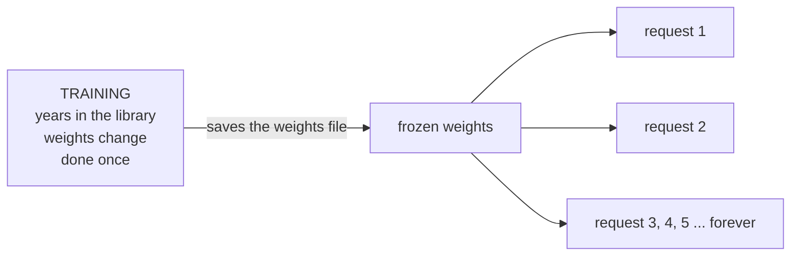

### Tokens: the student reads in syllables, not sentences

The model understands only numbers. A tokenizer is a dictionary that swaps each chunk of text for a number, like a Morse table, and swaps numbers back into text on the way out. It does no thinking. No neural network is involved in this step.

The vocabulary is the fixed set of chunks the model can read or write, usually over 100,000 of them. The model can never produce anything outside that set. Rare words get spelled out from smaller pieces. Every chunk written is one more pass of work, so text that splits into fewer chunks is faster and cheaper.

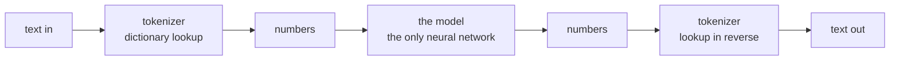

### Context window: one answer booklet per request, no extra pages

The context window is the total number of tokens the model can process and generate in one request. Think of it as an answer booklet with a fixed number of pages. The question, any scratch work and the answer all share those pages.

A request can hold up to three kinds of tokens. The input is what you send. Reasoning is optional scratch work that only thinking models produce. The output is the answer. A separate cap on answer length can limit the last part.

A new request is a new booklet. The student remembers nothing from the last one. A chat app gets around this by photocopying the earlier turns into every new booklet, which is why a long chat runs out of pages.

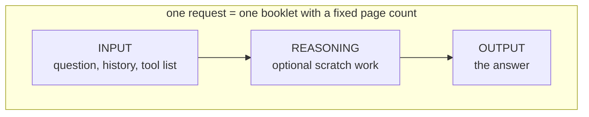

### Input: the app packs the bag, the model only unpacks it

The student never chooses what lands on the desk. The application gathers the developer's rules, the earlier turns, the new message and the list of tools. A template then arranges them into the one format this model expects. If the packing is wrong, the model reads garbage and no amount of model quality fixes that.

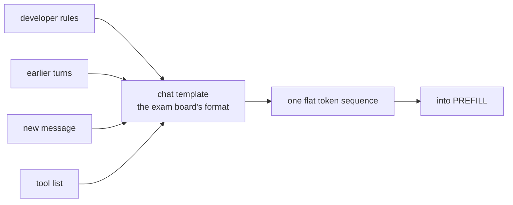

### Prefill and decode: read in bulk, write in drips

The question paper already exists in full, so the student takes it in all at once. That is prefill. The answer does not exist yet, and word 5 depends on word 4, so it can only be written one word at a time, each word needing its own pass through the student's head. That is decode.

The two phases stress the hardware differently: reading is one big job, writing is many small repeated ones. Why that difference matters on a GPU is the next thing to work out.

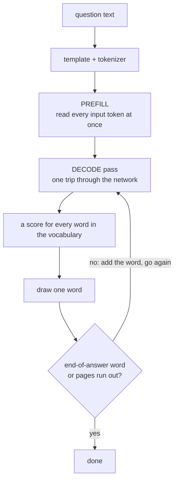

### KV cache: margin notes beat rereading

For a step called attention, each word needs to look back at earlier words. (The details of attention are not in these notes yet.) While reading, the student jots two margin notes beside every word. K is a label saying what the word is about. V is what the word contributes if someone looks it up.

A word only ever depends on the words before it, so its notes never change once written. When writing the answer, the student glances at the margin instead of rereading the paper and redoing every note. That margin is the KV cache.

The price is desk space. The margin lives in GPU memory and grows by one entry for every word, so long conversations use more of it.

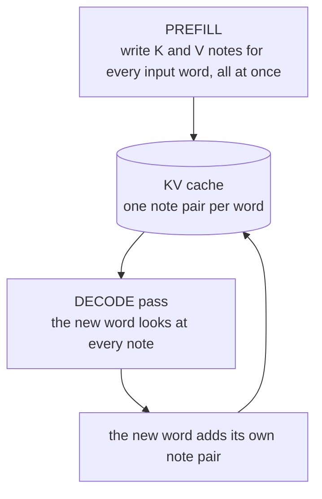

### Picking the next word: scores in, lottery ticket out

At the end of every pass the network hands every word in the vocabulary a number of tickets. More plausible words get more. One ticket is drawn at random. The model does not decide, the lottery does, and training is what makes the right word hold most of the tickets.

Three dials shape the draw:
- **Temperature** sharpens or evens out the piles. At 0 the biggest pile always wins, so the same input always gives the same output. Higher values move tickets toward small piles, so surprises get likelier.
- **Top-k** trims by count: only the k biggest ticket holders enter the draw.
- **Top-p** trims by share: the biggest holders enter until together they hold p percent of all tickets.

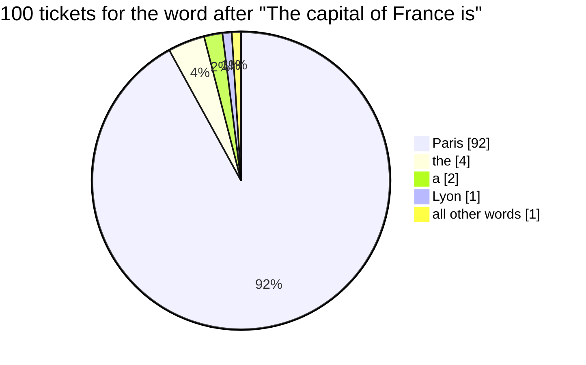

### Stopping: stop at the full stop, or when the pages run out

The student keeps writing until it produces a special end-of-answer word, or until the booklet is full, or until the answer-length cap is reached. An answer that ends mid-sentence usually means a limit was hit, not that the student finished.

## §2.2.1 LLM architecture and size

### Architecture: the plan is not the bricks

An architecture is a building plan: which parts exist, how they connect, and what shape each part has. For an LLM the plan is a tall stack of identical blocks. Token numbers enter at the bottom and scores for the next word come out at the top. Parameters are the actual numbers that fill the plan, the weights and biases inside every layer. "8B" means 8 billion of them.

### Model sizes: same plan, bigger dials

Going from an 8B build to a 30B build means no redesign. You turn dials: more blocks in the stack, wider layers, more attention heads. Width counts double. A layer's weight table is as wide as it is tall, so a layer twice as wide holds about four times the numbers.

More numbers means more to store. At 2 bytes per number, 8B is about 16 GB and 30B is about 60 GB, just to hold the weights and before any KV cache.

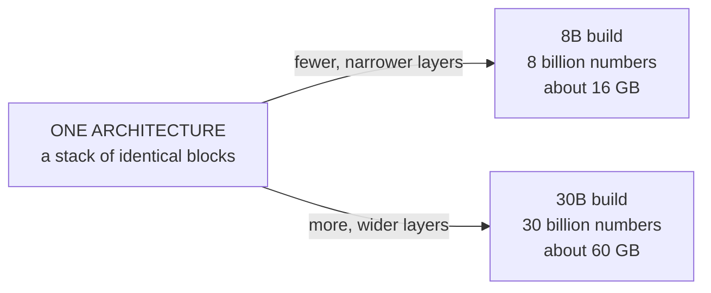

### Causal: each word looks left, never right

Most chat LLMs are causal. When a word is processed it may only look at the words before it. That single rule is why a word's margin notes never change, so the KV cache works. It is also why writing goes one word at a time: the words to the right do not exist yet.

### Base vs instruct: base finishes your sentence, instruct answers your question

A base model was trained only to guess the next word over a huge pile of raw text. It holds the knowledge but has no idea you asked a question. A question looks to it like the first line of a worksheet, so it writes the next line, and nothing taught it when to stop.

An instruct model is the same student after a short coaching course. It is first shown many example questions with good answers. Then people rate its answers and it is nudged toward the preferred ones. That coaching adds tone, polite refusals, the chat format and the habit of stopping when done. Plan and size stay the same, the numbers move a little.

To tell them apart, look at the name. Words like Instruct, Chat or IT mean the coached version. A name without them is usually the base. Use instruct for chat, answers and tools. Use base for plain continuation, or as the starting point for your own fine-tune. An instruct model needs its own chat template at inference time, a base model takes plain text.

Almost all the training cost goes into the base. The coaching on top is small, which is why one base usually ships with an instruct sibling of identical size.

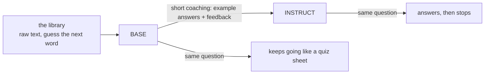

## Next session
Work out why prefill and decode stress a GPU differently (compute-bound vs memory-bound), then continue to the transformer block, attention and mixture of experts.
