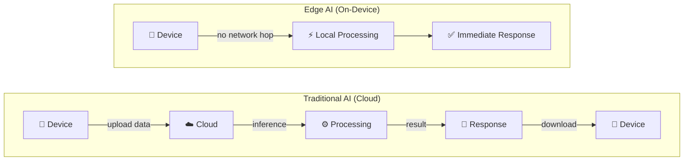

# Module 00 — Introduction to EdgeAI

**Status:** In Progress
**Source:** https://github.com/manojbaliyan16/edgeai-for-beginners/blob/main/introduction.md

## Key Concepts

### The Edge AI Paradigm

Traditional (cloud) AI puts a network round-trip in the critical path of every inference. Edge AI removes it by running the model on-device.

**Why this shift matters — eliminating the round-trip enables:**

| Benefit | Why |
|---|---|
| Instantaneous responses | Sub-millisecond latency — no network hop, no cloud queue |
| Enhanced privacy | Data never leaves the device |
| Reliable operation | Works without internet connectivity |
| Reduced costs | Minimal bandwidth and cloud compute usage |

## Connects to what I already know
- TensorRT/YOLOv8 edge inference (P1.1-P2.2 work)
- Quantization work on sdv-edge-gateway (fbgemm/cuda)
- RTCU edge telemetry pipeline (automotive telematics)

## Open Questions

## Exercise Notes
